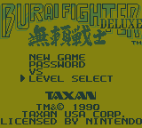
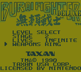
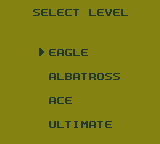
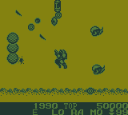

# Burai Fighter Deluxe: Level Select

A level select and starting loadout menu for **Burai Fighter Deluxe** on Game Boy. The new **LEVEL SELECT** choice appears on the title screen alongside **NEW GAME**, **PASSWORD**, and **VS**. NEW GAME still follows the original start sequence.

**[Download the v1.0 IPS patch and instructions](https://github.com/wavedout/Burai-Fighter-Deluxe-Level-Select-ROM-Hack/raw/refs/heads/main/Burai-Fighter-Deluxe-Level-Select-v1.0.zip)**

## Features

- Start at any of the five stages.
- Set your starting lives to **3**, **5**, **9**, or **INFINITE**.
- Start with the base gun; select **LASER**, **RING**, or **MISSILE**; or choose a **FULL** loadout with all three weapons powered up and one equipped at the start.
- Choose from the game's original **Eagle**, **Albatross**, **Ace**, and **Ultimate** difficulties after setting your options. The original game calls this difficulty screen **SELECT LEVEL**.
- Return with B from either the settings or difficulty screen. The password screen returns to the title with B when its entry is empty.

The original password system is still available. Burai Fighter Deluxe does not use battery-backed saves. VS remains the original Game Link Cable mode.

## How to play

Select **LEVEL SELECT** from the title screen. On its settings page, use Up/Down to choose **STAGE**, **LIVES**, or **WEAPONS**. Press Right or A for the next value, or Left for the previous value. Press Start to open the difficulty screen, then choose a difficulty to play. B returns to the preceding screen; your settings remain selected if you go back from difficulty.

Weapon options cycle through **BASE**, **LASER**, **RING**, **MISSILE**, **FULL LASER**, **FULL RING**, and **FULL MISSILE**. Choosing LASER, RING, or MISSILE starts that weapon at maximum power. The FULL options start all three weapons at maximum power; the second line indicates which one is equipped first. These are starting loadouts: the game's normal weapon changes and death rules apply after play begins.

Lives are **total** starting lives; the in-game display counts spare lives. For example, choosing 3 starts with 2 shown in the HUD. INFINITE displays 99.

## Apply the patch

Apply `Burai Fighter Deluxe - Level Select.ips` to an **unmodified Burai Fighter Deluxe (USA, Europe)** Game Boy ROM with an IPS-compatible patcher. Keep a copy of your original ROM. The download contains a patch, not the game.

| Original ROM | Value |
| --- | --- |
| Size | 65,536 bytes |
| CRC32 | `3C86F5DB` |
| MD5 | `DD5AA6E85827A3CE6E4B7500E75A3262` |
| SHA-1 | `178E18B7E6E65E726B4E06F80D89C55332EA868B` |

The resulting ROM's CRC32 is `288D8F3C`. A different ROM revision may not work with this patch.

## Screenshots

| Title menu | Level Select settings | Difficulty | Gameplay |
| --- | --- | --- | --- |
|  |  |  |  |

## Source

`source/build_burai.py` builds the patch from the original ROM with Python 3:

```sh
python3 source/build_burai.py "/path/to/Burai Fighter Deluxe (USA, Europe).gb"
```

It checks the source ROM's CRC32 and writes the patched ROM and IPS patch to a local `build/` directory. The repository and release archive do not include a ROM.

## Release

**v1.0 — September 25, 2026.** Initial public release. Created by **wavedout**.
